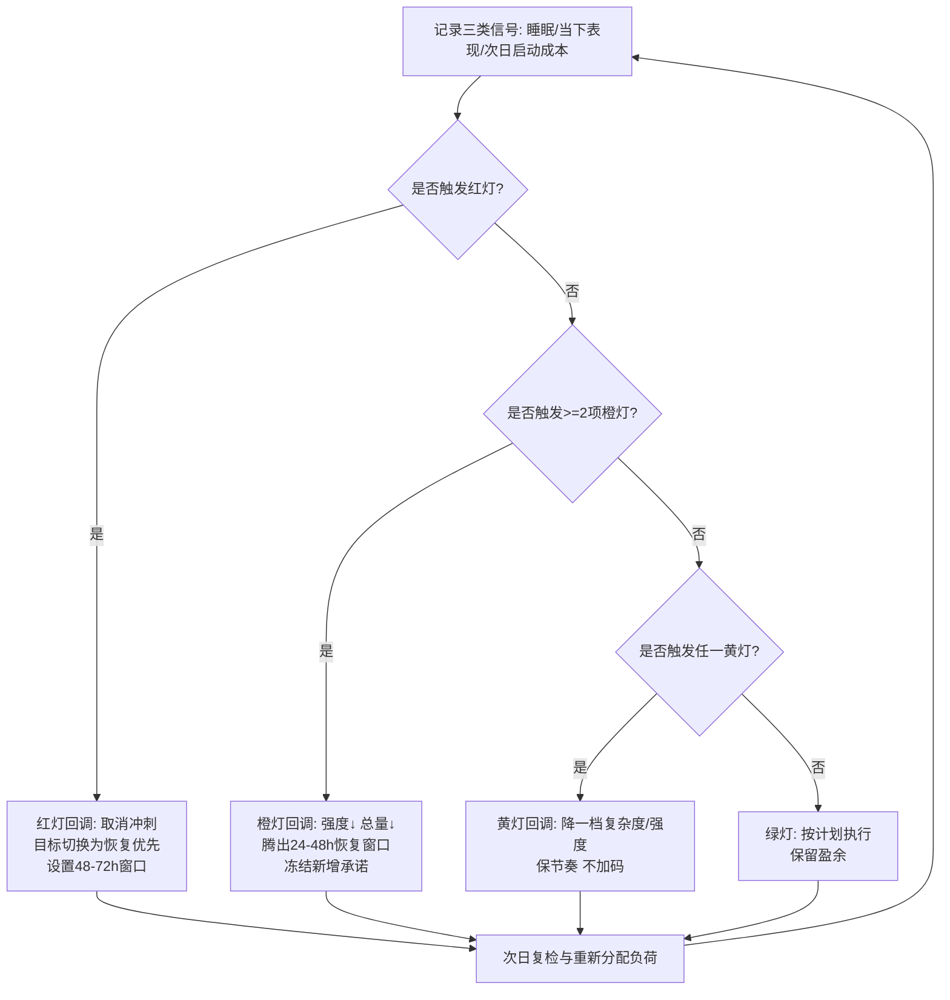

（本文由 Ricky 和 ChatGPT 共同创作）

你以为自己在"更努力"，实际在做一件更危险的事：让明天变成盲盒，然后用今天的强度去赌一次恢复。可只要某个晚上睡得很差，后面两三天就像被"连锁反应"接管——注意力碎裂、情绪阈值变低、训练中断、工作收不了尾。更麻烦的是，你未必困到倒头就睡；有时反而处在高唤醒状态，越熬越清醒，第二天像踩着棉花。

多数人会把它归因到两件事：自律不够，或强度太大。对我更有解释力的变量是第三个：**恢复能否按计划发生**。强度提高会让你感觉在前进；恢复失约会让明天变成未知数。未知数一旦出现，人会把所有事情往今天挤：晚睡补工、训练加码、咖啡续命。短期进度看似更快，系统却更难回到可持续区间。

### 把"可恢复"说清楚

可恢复更像一个运营指标：**明天能否以预期的强度启动，并在不变形的情况下推进**。这个定义故意朴素，因为它把"感觉"换成可检验结果：能不能按计划继续输出。

### 为什么睡眠债危险：因为预测性在下降

睡眠不足会带来累积性的认知与反应性能下降，而且主观困倦感并不可靠——你可能觉得还能扛，但波动和错误率在悄悄上升。[^1] 更关键的变化是：你对明天状态的预期开始失真；计划开始像猜盲盒。盲盒越多，你越倾向用更大强度去"压住不确定"，恢复窗口被挤压，波动被放大，节奏被吞掉。

### 三个长期变量：预测性、波动、节奏

如果你优化的是长期总功率（连续多年都能产出与进步），需要保护三件事：

* **恢复可预测**（明天按计划启动的概率要高）
* **波动可控**（避免频繁制造"今天爆发—明天报废"的尖峰）
* **节奏不断**（把输出做成可重复循环，而非靠燃烧）

训练科学把这类失衡概括为"负荷—恢复失衡"，并区分短期可恢复的刺激与更危险的非功能性消耗（乃至过度训练综合征）。工作场景同样存在，只是更擅长伪装成"忙"。[^2]

### 一个实用系统：黄/橙/红 + 默认回调

难点常见于边缘状态：你知道该慢一点，却仍会冲进去。解决方法是提前写好回调：一旦出现信号，默认做什么，把系统拉回可恢复区。行为研究把这类写法称为 if–then 计划（implementation intentions），它能提升执行的启动概率与稳定性。[^3]

我把信号分成三档（阈值与动作模板见下表）：

* **黄**：轻微下滑，先降复杂度/强度，保节奏
* **橙**：波动开始吞节奏，同时降强度与总量，主动腾出恢复窗口
* **红**：组合信号出现，继续硬扛代价高，停止冲刺，把目标切到恢复优先

### 两个例子

**运动**（以跑步为例，也适用于骑行/划船机等耐力运动）：当你在原计划强度下，连续两分钟连完整一句话都说不顺（Talk Test 进入"勉强/不舒服"阶段），立刻把强度降到能稳定说话，再决定是否缩短训练或改走跑交替。Talk Test 与通气阈附近强度贴近，用来现场止损很省脑力。[^4]

**工作**：当你在晚上十点后进入"窗口频繁切换、消息越回越多、任务越做越碎"，并且预感明天启动会更难，执行"12 分钟硬收尾"：写下明天前三步（动词开头、可交付），把未完成归档进收件箱，明确止损点并关机。你在投资的不是自律形象，而是明天的启动成本与节奏连续性。

### 盈余：用于再投资的可支配资源

盈余可以理解为：系统支付运转成本后仍可支配的资源；它未必等同于舒适感。盈余一旦出现，你才有选项去做慢回报再投资（复盘、写模板、做工具），也才更敢做小试错。长期来看，这些再投资会降低单位产出的"运转成本"，让恢复更可预测、波动更可控。

### 一句话结论

长期稳定输出依赖三件事：恢复可预测、波动可控、节奏不断。强度可以有，但它需要服从这三件事；一旦信号亮灯，先执行回调，把系统拉回可恢复区，再谈更猛。

---

## 操作化阈值与决策流程

下表把"黄/橙/红"写成跨场景的可测信号与默认动作。表内阈值属于**证据启发下的代理指标**：它们不声称对所有人精确成立，建议你用 2–4 周记录建立个人基线后再校准（例如把"<6.5h"替换为你的"明显变差阈值"）。睡眠研究也提示：主观体感对真实下滑的追踪能力有限，因此表内更偏向"行为/结果型指标"。[^1]

| 灯号 | 可测信号（代理指标；满足任意一条可视为触发）                                                                                                                                                          | 默认回调（运动）                                                          | 默认回调（工作）                                                          | 复检窗口                                 |
| -- | ------------------------------------------------------------------------------------------------------------------------------------------------------------------------------- | ----------------------------------------------------------------- | ----------------------------------------------------------------- | ------------------------------------ |
| 黄灯 | 睡眠：昨夜在床时间 < 6.5h，或入睡 >30 分钟，或夜醒≥2 次；当下：热身/低强度就感觉"费劲度"比平时高一档；运动现场：说话从"顺畅完整句"滑到"断续短句"（Talk Test 从 positive → equivocal）[^4]；工作现场：30 分钟内窗口/任务切换明显增多，开始用刷消息缓解焦虑；次日预期：隐约觉得"明天启动要变难"。 | 强度降一档（先把 Talk Test 拉回"能稳定说完整句"）；保持节奏与频率；把训练目标从"更猛"切换为"跑完/练完仍可恢复"。 | 复杂度降一档：把任务改写成"下一步可交付"；优先做单线程 25–45 分钟；晚间不追加新承诺。                   | 12–24h 内复检；优先把今晚变成"可预测的睡眠窗口"。        |
| 橙灯 | 睡眠：连续 2 晚落入黄灯睡眠阈值，或单晚 <5.5h；当下：同样任务启动成本显著上升（拖延、反复打开又关掉）；质量：明显返工/低级错误增多；运动：在原本轻松的强度就出现 Talk Test "不舒服/不能完整说话"，或心率/呼吸异常偏高（如你有基线数据，可用"同配速心率↑ ≥8–10 bpm"作增强信号）。                     | 同时降强度与总量：把计划量削减到 50–70%；取消高强度段；必要时改为散步/灵活性训练；避免连续尖峰。              | 冻结新增承诺；只保留 1–2 个"必须交付"；推迟高风险决策；执行"12 分钟硬收尾"，并把明天上午第一段深度时间预留给关键任务。 | 24–48h 恢复窗口；若连续两次橙灯，视为系统性失衡，需重排一周负荷。 |
| 红灯 | 组合信号：≥3 天睡眠明显失序且伴随情绪易激惹/注意力崩塌；功能：训练与工作同时变形（做了却不收敛、越做越散）；身体：出现明显不适并在休息后不缓解；或你处于安全敏感岗位且错误成本高（驾驶、手术、关键发布等）。训练领域把持续的"负荷—恢复失衡"视为需要严肃处理的风险状态。[^2]                                     | 取消冲刺与强刺激；把目标切到"恢复优先"；只保留低强度活动；若出现胸痛/眩晕等医学警示，停止运动并寻求专业评估。          | 启动"止损模式"：停止追加任务；只做最短路径的风险隔离与收尾；主动求援/重新协商期限；确保当晚尽可能进入更长睡眠窗口。       | 48–72h 恢复窗口；红灯后第一周避免连续透支。            |

关于负荷指标的证据边界：ACWR 相关研究存在系统综述结论强度有限、方法高度异质的问题，同时也存在对 ACWR 概念与统计属性的严肃批评；更稳妥的做法是把它当作"提醒你关注尖峰与结构"的粗信号，而非精密仪表。[^5]



---

## 低摩擦"恢复 / 盈余再投资"动作库

以下动作的设计原则是：**5–10 分钟、无需意志堆叠、对"明天能否按计划启动"有直接贡献**。其中部分属于生理恢复代理动作（目标是降低唤醒、减少摩擦），部分属于系统再投资（目标是降低未来运转成本）。它们不承诺立刻变强，承诺的是把未来维持在"可预测区间"的概率抬高。

**硬收尾（8–12 分钟）**
写下明天前三步（动词开头、可交付）；把未完成归档到单一收件箱；标注止损点（"剩余内容留到明早第一段深度时间"）。这本质上是把 if–then 的"触发→动作"落到日程层面。[^3]

**降唤醒走动（6–8 分钟）**
离开屏幕，低强度走动 6–8 分钟，同时刻意放慢呼吸（以"能用完整句说话"为自检）。它的目标是把"越忙越亢奋"的状态拉回到可睡、可收敛的区间（个体差异很大，作为代理动作使用）。

**单点复盘（7–10 分钟）**
只复盘一个触发器：今天让你波动变大的"尖峰"是什么（晚间会议、临时需求、训练加码）；把它写成 if–then：下次出现 X，我默认做 Y。该动作的价值来自"减少临场发明策略"。[^3]

**一处减摩擦投资（8–10 分钟）**
选一个重复动作做"模板化或自动化"的第一步：会议纪要模板、代码片段、回复话术、训练记录表。盈余再投资的关键不在宏大项目，落点在持续降低运转成本。

**透支结算点（5 分钟）**
当你必须冲刺（上线窗口、比赛、应急响应），用 5 分钟写死"结束点 + 代价上限"：到几点必须停、连续透支最多几次、下一次恢复窗口什么时候发生。它的目标是把透支从习惯变成可控债务。

---

## 方法学附录与可打印工具

### 关键证据速览（方法学摘要）

**睡眠限制与"自我感知不准"**
Hans P. A. Van Dongen 等人的实验显示：慢性睡眠限制会带来剂量反应式的神经行为功能下降，并呈现累积性；主观困倦感的变化幅度较小，难以充分反映真实下滑。[^1] 这支持本文把"预测性下降"当作核心风险：你会更容易高估自己对明天的掌控。

**过度训练/恢复失衡的共识框架**
共识框架强调：有效训练需要过载，也需要避免"过度过载 + 恢复不足"的组合；功能性超量刺激与非功能性消耗/过度训练综合征在表现、疲劳、情绪、睡眠等方面呈现差异与风险梯度。[^2] 本文借用该框架把"黄/橙/红"视为风险管理分级，而非道德判断。

**负荷结构：单调性与应变**
Carl Foster 的研究讨论了用训练单调性（monotony）与应变（strain）等指标监测训练负荷结构，并将其与疾病/小伤发生联系起来。[^6] 这支持"风险不只来自总量，也来自结构与连续尖峰"的写法。

**ACWR：证据混合与方法学争议**
系统综述指出 ACWR 与伤病风险之间在多研究中存在关联线索，但同时强调研究方法高度异质，限制了可操作的强结论；同时也有研究者对 ACWR 的概念与统计属性提出批评，认为它不适合作为负荷管理系统的核心指标。[^5] 因此本文采用保守建议：把 ACWR/尖峰当作提醒信号，核心仍回到"是否可恢复、是否可预测"。

**Talk Test：现场调强度的低成本工具**
Talk Test 研究支持其与通气阈附近强度贴近；当说话开始变困难时，强度接近通气阈；当说话不再舒适时，强度通常高于阈值。[^4] 这为"现场止损、把系统拉回可持续区"提供了可操作工具。

**if–then（implementation intentions）对执行稳定性的影响**
关于 implementation intentions 的综述与元分析表明：以"如果出现情境 Y，就执行行为 X"的结构形成 if–then 计划，可在多目标领域提升目标实现与执行启动。[^3] 这支撑"不要临场发明策略，要预写默认回调"。

---

### 每日一页检查表（可打印/可复制到备忘录）

```text
可打印/可复制检查表
```

**早晨 2 分钟：记录三类信号（建议连续 14 天建立基线）**  
睡眠  
- 在床时间：____ 小时（代理阈值：<6.5h 视为黄；<5.5h 视为橙）  
- 入睡耗时：____ 分钟（>30 分钟黄；>60 分钟红的候选信号）  
- 夜醒次数：____ 次（≥2 次黄）

当下表现（工作）  
- 我能在 10 分钟内启动第一个关键任务吗：□能 □很难  
- 过去 30 分钟窗口/任务切换明显增多吗：□否 □是  
- 返工/低级错误显著增多吗：□否 □是

当下表现（运动/训练）  
- 热身时费劲度比平时高一档吗：□否 □是  
- Talk Test：□能稳定说完整句 □只能断续短句 □说话不舒服/说不出

**判定灯号（按"最保守"原则）**  
- 红灯：出现红灯组合信号（睡眠连续失序 + 工作/训练同时变形），或你处在错误成本极高的任务中 → 直接红灯  
- 橙灯：橙灯信号 ≥2 项（或黄灯连续 2 天） → 橙灯  
- 黄灯：任一黄灯信号 → 黄灯  
- 否则：绿灯

**默认回调（不需要再思考）**  
黄灯回调（保节奏）  
- 工作：把任务改写成"下一步可交付"；单线程 25–45 分钟；今晚不追加新任务  
- 运动：降一档强度，把 Talk Test 拉回"能完整说话"；保持频率

橙灯回调（强度↓ + 总量↓）  
- 工作：冻结新增承诺；只保留 1–2 个必须交付；执行 12 分钟硬收尾；预留明早深度时间  
- 运动：训练量削到 50–70%；取消高强度；必要时只做低强度活动

红灯回调（恢复优先）  
- 工作：止损模式：只做风险隔离与最短路径收尾；协商期限/求援；确保睡眠窗口  
- 运动：取消冲刺与强刺激；只保留低强度活动；若有医学警示立即停止并评估

**复检**  
- 黄：12–24h 内复检  
- 橙：24–48h 内复检，连续两次橙灯需重排一周负荷  
- 红：48–72h 恢复窗口，红灯后 1 周避免连续透支

---

## 参考文献

[^1]: Van Dongen, H. P. A., Maislin, G., Mullington, J. M., & Dinges, D. F. (2003). *The cumulative cost of additional wakefulness: dose–response effects on neurobehavioral functions and sleep physiology.* PubMed: [https://pubmed.ncbi.nlm.nih.gov/12683469/](https://pubmed.ncbi.nlm.nih.gov/12683469/)

[^2]: Meeusen, R., et al. (2013). *Prevention, diagnosis and treatment of the overtraining syndrome.* PubMed: [https://pubmed.ncbi.nlm.nih.gov/23247672/](https://pubmed.ncbi.nlm.nih.gov/23247672/) ；以及 IOC 负荷共识（PDF）: [https://stillmed.olympics.com/media/Documents/Athletes/Medical-Scientific/Consensus-Statements/2016_How-much-is-too-much-load-sport-risk-illness-part-1.pdf](https://stillmed.olympics.com/media/Documents/Athletes/Medical-Scientific/Consensus-Statements/2016_How-much-is-too-much-load-sport-risk-illness-part-1.pdf)

[^3]: Implementation intentions（if–then 计划）综述章节（含元分析脉络）: [https://www.sciencedirect.com/science/chapter/bookseries/pii/S0065260106380021](https://www.sciencedirect.com/science/chapter/bookseries/pii/S0065260106380021)

[^4]: Talk Test 经典研究（PubMed）: [https://pubmed.ncbi.nlm.nih.gov/15354048/](https://pubmed.ncbi.nlm.nih.gov/15354048/)

[^5]: ACWR 系统综述（PMC 全文）: [https://pmc.ncbi.nlm.nih.gov/articles/PMC7047972/](https://pmc.ncbi.nlm.nih.gov/articles/PMC7047972/) ；ACWR 概念/统计属性批评（PubMed）: [https://pubmed.ncbi.nlm.nih.gov/32502973/](https://pubmed.ncbi.nlm.nih.gov/32502973/)

[^6]: Foster, C. (1998). *Monitoring training in athletes with reference to overtraining syndrome.* PubMed: [https://pubmed.ncbi.nlm.nih.gov/9662690/](https://pubmed.ncbi.nlm.nih.gov/9662690/)
